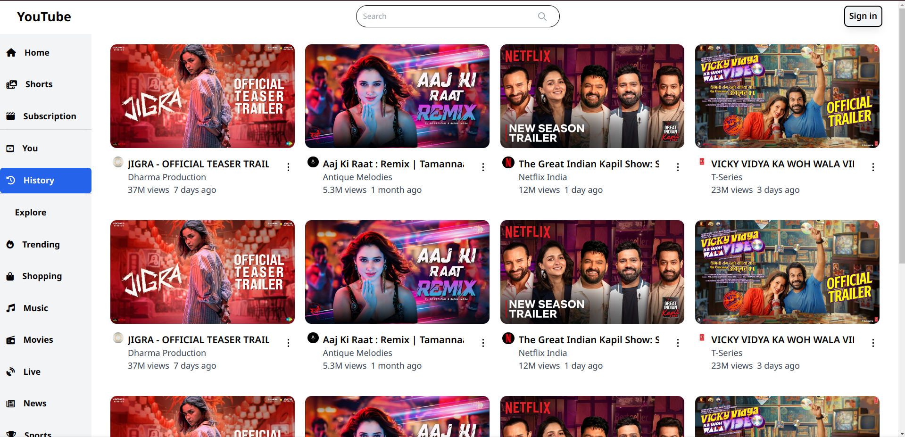

# YouTube Landing Page Clone

This project is a responsive YouTube landing page clone created using **Tailwind CSS**. It includes a basic navbar, sidebar, and a responsive layout that adapts to different screen sizes.This project is for practicing **Tailwind CSS**

## Features

- Responsive design using Tailwind CSS.
- Basic Navbar.
- Sidebar.
- Search bar, sign-in button.

## Preview



## Getting Started

To run this project locally, follow these steps.

### Prerequisites

Make sure you have **Node.js** and **npm** (or **yarn**) installed on your machine.

- [Node.js](https://nodejs.org/en/download/)
- [npm](https://www.npmjs.com/get-npm)

### Setup

1. **Clone the repository**:

   ```bash
   git clone https://github.com/kundusubrata/Youtube-landing.git
   ```
2. **Navigate to the project directory:**
	```bash
	cd Youtube-landing
	```
3. ****Install dependencies and Run the project locally:**
	```bash
	npm install
	npm run dev
	```
